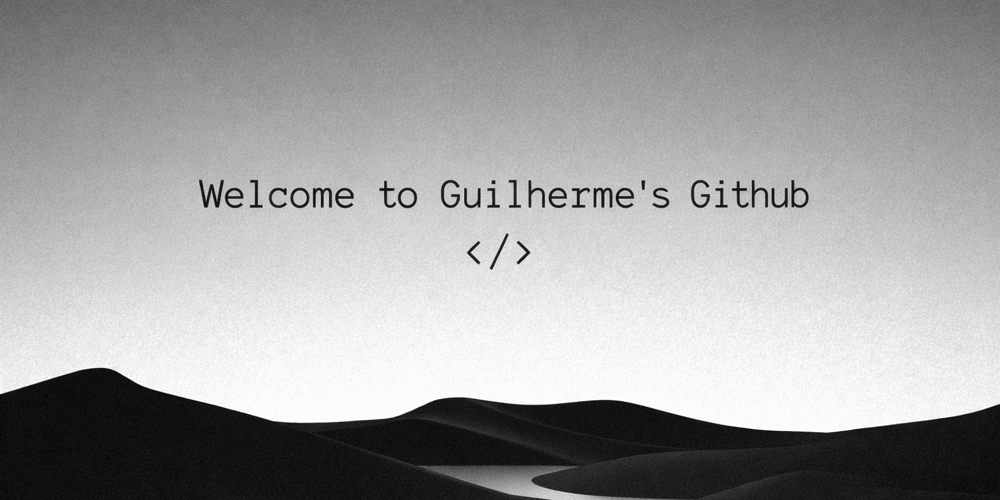

<h1 align="center"> Guilherme Pimentel da Rocha</h1>
<h3 align="center">Estudante de Informática | Foco em Back-End</h3>

  
  
  

---

## 🧠 Sobre mim

Olá! Sou o Guilherme, estudante do curso técnico em Informática no IFRO.

💻 Atualmente estudando e praticando:
- C#
- Programação Orientada a Objetos
- Modelagem de Banco de Dados
- PHP
- HTML e CSS
- Lógica de Programação

🎯 Buscando evoluir como desenvolvedor Back-End.  
♟️ chess player — estratégia no tabuleiro e no código.

---

## 🛠️ Tecnologias

  
  
  
  
  
  
  
  

---

## 📌 Projetos

🚗 Sistema de Aluguel de Carros (C# – POO)  
🔐 Sistema de Login com Recuperação de Senha (PHP + MySQL)  
🌐 Página Web Responsiva com Galeria Animada  
🗄️ Projetos de Modelagem de Banco de Dados  

---

## 📊 Estatísticas

  

---

## ♟️ Xadrez & Lógica

O xadrez fortalece minha capacidade de análise, planejamento e tomada de decisão — habilidades que aplico diretamente no desenvolvimento de sistemas.

---

  <em>"Código limpo. Lógica clara. Evolução constante."</em>

